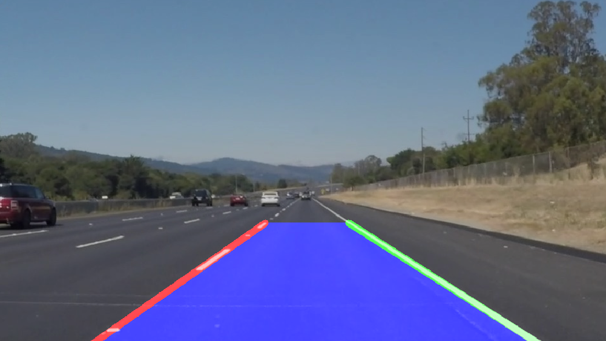

simple lane detection
---
detects straight lane lines.

**NOTE: for v2 with curved lane detection, check out [curved-lane-lines](https://github.com/kemfic1/Curved-Lane-Lines)**

for an in-depth writeup, check out the [report](https://www.hackster.io/kemfic/simple-lane-detection-c3db2f)

